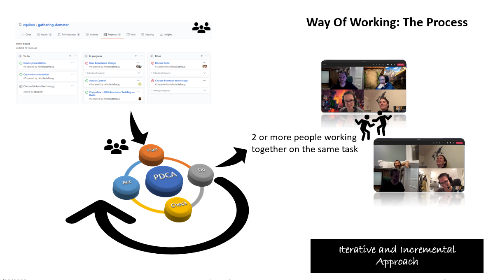

# Equinor Timer
This app can be used to set up multiple timers that run in parallel or timers trigger when other timers finish.

Examples:
- When making a dinner you would like to start making the different dishes at different times, and sometime a dish can't be started until another is finished.
- Could also be used when holding a presentation to time the different parts of the presentation.

Design we are going towards:


# Way of Working

## The Pillars


## The Process




# Run project using Docker
```
docker build -t timer .
docker run -p 8000:8000 --rm --name timer timer
```

# Run project without Docker
Assumes you have python and node installed. 
